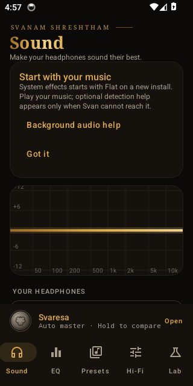
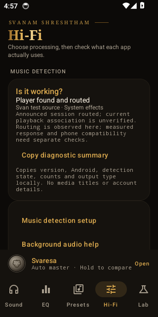

<div align="center">

# Svan · स्वन्

A system-wide equalizer for Android.


[](https://github.com/iamhariize-maker/Equalizer-app/actions/workflows/ci.yml)

[Download the beta](https://github.com/iamhariize-maker/Equalizer-app/releases/tag/v0.5.5-beta.1) ·
[Report your device](https://github.com/iamhariize-maker/Equalizer-app/issues/new?template=device-report.yml) ·
[Compatibility](docs/COMPATIBILITY.md) ·
[Setup guide](docs/SETUP.md)

</div>

Svan (स्वन्) is the Sanskrit word for sound. The full name is Svanam Shreshtham: Ultimate Sound.

It's an equalizer that works across the apps on your phone instead of inside a single player. You can load a correction for your headphones from the AutoEq database, tweak it by hand with up to 256 parametric bands per channel, and not worry about clipping when you boost. It doesn't need root.

Svan is in beta and I'm still finding out which phones, players and Bluetooth setups it actually works with. If you try it, please tell me what happened, even if the answer is "nothing". The [device report form](https://github.com/iamhariize-maker/Equalizer-app/issues/new?template=device-report.yml) takes about a minute.

<p align="center">
  
  &nbsp;&nbsp;
  
</p>
<p align="center"><sub>Screenshots from an Android emulator with a test player, not from a real phone or music app.</sub></p>

## How it works

There are two engines, and each app's audio goes through exactly one of them.

System effects is the default and the one I'd suggest. It uses Android's own `DynamicsProcessing` effect on other apps' audio sessions, so latency is low and it works with apps that block audio capture, like Spotify. The catch is that it only does gain per band, and Android decides the precision.

The Audiophile engine captures the playback, runs it through the 64-bit C++ chain in `core/`, and plays it back. That gives you the full set of tools: oversampled EQ, dither, gain protection. It's also experimental. It adds delay (noticeable on Bluetooth), asks for a capture permission every session, and can't do bit-perfect or USB DAC passthrough.

A fresh install starts on System effects with a flat curve and 0 dB preamp. More detail in [ARCHITECTURE.md](docs/ARCHITECTURE.md) and [AUDIOPHILE.md](docs/AUDIOPHILE.md).

To show what the Audiophile engine does to a song, use Recording mode in Hi-Fi ([RECORDING_MODE.md](docs/RECORDING_MODE.md)); screen recorders can't capture that engine.

## Getting started

1. Download the APK and `SHA256SUMS` from the [release page](https://github.com/iamhariize-maker/Equalizer-app/releases/tag/v0.5.5-beta.1) and check the hash with `sha256sum -c SHA256SUMS`. Keep Play Protect on. If Android blocks the install, stop and [send me the exact message](https://github.com/iamhariize-maker/Equalizer-app/issues/new?template=bug_report.yml).
2. Open Svan and play some music. You don't have to set anything up first.
3. Go to Hi-Fi and look at "Is it working?" to see whether your player and output are listed.
4. If your player isn't reachable, the optional Fix music detection wizard uses Shizuku to sort it out. [docs/SETUP.md](docs/SETUP.md) walks through it.
5. In Presets, search for your headphones to load an AutoEq correction, or import a profile file.

You need Android 10 or newer on arm64 or x86_64. If you used an earlier preview, read [moving from preview](docs/MOVING_FROM_PREVIEW.md) before you uninstall anything.

## What doesn't work yet

I haven't been able to test most of this on real hardware. The compatibility table says exactly how each row was checked, and most of it is still "unverified".

On the one phone I've used for listening (a TECNO LH7n on Android 14), the Audiophile engine sounded delayed or doubled over Bluetooth, and a few players weren't detected. I don't know why yet. If you hear that too, switch to System effects.

Apps that block capture only work with System effects. The numbers in the docs come from synthetic tests, so they say nothing about how it sounds or about total latency on a phone. And this is a beta, not a store release.

## The DSP core

The `core/` folder is a portable C++17 library that the Android app uses. It has a parametric EQ where band changes never block the audio thread, AutoEq import (`ParametricEQ.txt` and `GraphicEQ.txt`), double-precision processing throughout, 2x/4x/8x oversampling, a resampler with two quality settings (not used on Android, where capture stays at 48 kHz), TPDF and noise-shaped dither, automatic headroom, and gain protection for real overloads. There are 98 unit tests, and CI also runs them under ASan and UBSan.

## Build and test the core

```sh
cmake -S core -B build/core && cmake --build build/core -j
./build/core/eqcore_tests
./build/core/eqcore_bench
# Sanitizers:
cmake -S core -B build/asan -DEQCORE_SANITIZE=address,undefined -DCMAKE_BUILD_TYPE=Debug && cmake --build build/asan -j && ./build/asan/eqcore_tests
```

## Build the Android app

Requires the Android SDK with NDK 27.0.12077973 and CMake 3.22.1. Gradle installs them automatically if the licences are accepted.

```sh
cd android && ./gradlew assembleDebug
adb install app/build/outputs/apk/debug/app-debug.apk
# Optional, enables enhanced session detection (the Wavelet approach):
adb shell pm grant app.svan android.permission.DUMP
```

Then follow [docs/SPIKE.md](docs/SPIKE.md).

For phone-only setup on Android 11+, use Hi-Fi → Music detection and its Shizuku
guide. Once the user-authorized setup grants detection access, Shizuku and wireless
debugging can be stopped. See [phone validation](docs/PHONE_VALIDATION.md).

The optional [Shizuku API](https://github.com/RikkaApps/Shizuku-API) is MIT licensed,
Copyright (c) 2021 RikkaW. Its full notice ships in `assets/licenses/Shizuku-API-MIT.txt`.

## Bugs, reports and code

For device reports use [this form](https://github.com/iamhariize-maker/Equalizer-app/issues/new?template=device-report.yml), and for bugs use the [bug form](https://github.com/iamhariize-maker/Equalizer-app/issues/new?template=bug_report.yml). Issues are public, so look over any logs or screenshots before you post them.

The source is public so you can read it, but it isn't licensed for reuse, so I'm not taking code pull requests for now. [CONTRIBUTING.md](CONTRIBUTING.md) has the details. If you find Svan useful, a star helps other people come across it.

## Licence

All rights reserved. See [LICENSE](LICENSE). The beta is free to use for personal evaluation. Third-party code and assets keep their own licences, and no GPL code has been copied into Svan.

## Brand assets

The launcher mark is a modern **स्व** (sva, as in स्वनम् — "Svan") generated by
`tools/brand/make_icon.py` from **Poppins SemiBold** glyph outlines
(Indian Type Foundry, [SIL Open Font License 1.1](https://openfontlicense.org)),
shaped with HarfBuzz, with a continuous brass shirorekha inside the yantra ring.
