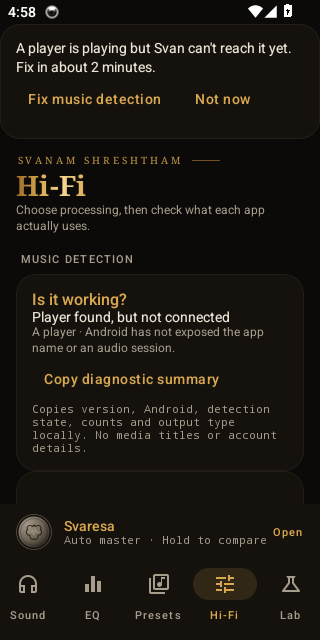

# Start listening, then fix detection only if needed

This guide describes 0.5.6. Use the owner-signed APK from its published GitHub beta
and verify the hash and signer against that release's notes. Preview and owner signing
identities differ; follow [preview migration](MOVING_FROM_PREVIEW.md) before uninstalling.

1. Open Svan and play music. A fresh install starts System effects, Flat, 0 dB preamp,
   and Audiophile off. The welcome card can be dismissed; no Shizuku setup blocks first run.
   This does not promise processing for every player or output path.
2. In **Hi-Fi → Is it working?**, look for the actual player and route. Nothing playing,
   a player with no connection/reason, and routed System effects/Audiophile are distinct.
   Unavailable playback data says “can't tell.” A running service alone is not a connection.
3. If music is active but no usable session is exposed and DUMP is missing, the contextual
   card offers **Fix music detection**. **Not now** hides it; **Hi-Fi → Reset hidden setup
   prompts** restores it. Names are shown only when known. Android's anonymous playback
   data uses “A player”; its dismissal is remembered for anonymous playback, not an
   invented app identity. Named-player dismissal is per package.
4. The optional wizard shows live installation, debugging, running binder, authorization
   and audio-report access statuses. Install official Shizuku with Play Protect enabled. Android 11+
   phone-only setup needs Wi-Fi: enable Developer options/Wireless debugging, pair and
   start Shizuku, then return and allow Svan. Pairing is not independently observable;
   the running tick proves a live binder. Settings shortcuts fall back to instructions.
   Android 10 lacks that phone-only wireless route; broadcasting players still work without it.
5. Shell-report mode reads the two fixed audio reports through Shizuku without granting
   Svan DUMP. Keep Shizuku running for that mode. A direct route can substitute when the
   helper process cannot answer; an error includes the failed route rather than claiming success.
6. To remove Shizuku, explicitly tap **Keep enhanced detection without Shizuku** while
   Shizuku is connected. Confirm that enhanced detection is built into Svan before
   uninstalling Shizuku. This grants only Svan its own DUMP permission. Developer options
   can be turned off, but doing so is not required for Svan's retained grant. The owner
   reports BHIM and GPay working after Shizuku removal with Developer options still on;
   other phone/app combinations need their own checks.
7. Use **Finish** to return to Svan. Missing or denied debugging-setting reads say
   **Can't tell**; they never become a false “off” tick. Finishing does not switch settings
   or stop Shizuku automatically. Android can revoke the app grant and uninstalling Svan
   removes it. Same-key update and reboot retention still need final-beta phone validation.

**Copy diagnostic summary** copies only versions, detection state, scan/counts, engine routes and generic
output type locally. It has no media titles, account data, raw audio report or output address
and opens no share sheet. **Share detailed report** remains a separate explicit action;
review it before sending. Nothing is uploaded automatically.

**Background audio help** is available from the welcome and Hi-Fi. It offers conservative
TECNO/Infinix, Xiaomi, Realme/OPPO, Samsung or generic guidance and Android settings links.
No battery exemption permission is added and no setting is changed automatically.
See [player evidence](COMPATIBILITY.md), [phone validation](PHONE_VALIDATION.md) and
[privacy](PRIVACY.md).

## CI screenshots

Live first-run, unreachable and System-effects screenshots are captured by
`onboarding_e2e.sh`; actual authorization/grant/finish comes from `detection_release.sh`.
`screens.sh` also captures all wizard and working-status states with an explicit **UI test
fixture** banner. Those fixture images verify layout, not real Shizuku grants, debugging-off
transport or Audiophile startup.

The images below are unchanged CI captures from build `49f3348`, API 34,
[run 37414766431](https://github.com/iamhariize-maker/Equalizer-app/actions/runs/37414766431).
They were inspected at their native 320 × 640 phone size. Later local-summary wording and
fixture scroll/label fixes are checked in the final branch CI, not silently substituted into
these images. [Verification record](ONBOARDING_VERIFICATION.md) includes the measured comparison.

Wizard live captures: [install](images/setup/wizard-install-live.png),
[authorize](images/setup/wizard-authorize-live.png),
[actual DUMP success](images/setup/wizard-finish-live.png).
On that emulator, USB is on and Developer options cannot be read; the warning stays visible.
Finish is below the fold and is reached by scrolling.

Labelled layout fixtures: [debugging off](images/setup/debugging-off-fixture.png),
[debugging on](images/setup/debugging-on-fixture.png),
[unknown](images/setup/debugging-unknown-fixture.png).
These are deliberately simulated UI states, not proof that ADB was switched off during CI.

Real-device pairing, Settings.Global access and shortcuts, grants retained after update,
Bluetooth behavior, other payment-app/phone combinations and OEM background restrictions
need separate checks. The owner's current-preview playback/BHIM/GPay evidence is recorded
in [phone validation](PHONE_VALIDATION.md). Emulator fixtures do not verify TECNO, LG or
commercial players, and the historical images above do not show the current shell-mode flow.
